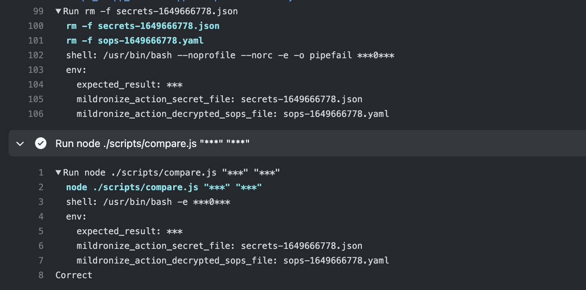

# actions-get-secret-sops
GitHub Action get secret with specific key from encrypted SOPS yaml file.

## Build Status (GitHub Actions)

| Encryption Method | Status |
|-------------------|--------|
| Age               | [](https://github.com/mildronize/actions-get-secret-sops/actions/workflows/test-sops-age.yaml)   |
| Azure Key Vault   | [](https://github.com/mildronize/actions-get-secret-sops/actions/workflows/test-sops-azure-key-vault.yaml)  |

## Features
- Support Azure Key Vault, Age
- Only support Linux Runner
- Hide secret from SOPS yaml file when read it



## Usage

### Using Age

Set the secrets name of Age Private Key:

```yml
steps:
  - uses: actions/checkout@v3
  - uses: mildronize/actions-get-secret-sops@v1
    id: sops
    with:
      path: "examples/data.age-enc.yaml"                     
      property-path: ".scope_a.app_service.app1"              
      decrypting-key: ${{ secrets.Age_SOPS_github_action }}                 
      sops-version: '3.7.2'
  - run: echo "${{ steps.sops.outputs.secret }}"
```

### Using Azure Key Vault

When you create Azure Credential with:

```bash
az ad sp create-for-rbac -n "my-service-principal-name" --role Contributor --scopes /subscriptions/xxxxxxx
```

it will generate json, the structure of secret:

```json
{
  "appId": "<some-uuid>",
  "displayName": "my-service-principal-name",
  "password": "<some-uuid>",
  "tenant": "<tenant-id>"
}
```

Set the secrets name `Azure_Credential` or name what you want.

```yaml
steps:
  - uses: actions/checkout@v3
  - uses: mildronize/actions-get-secret-sops/azure@v1
    id: sops
    with:
      path: "azure.enc.yaml"                          # Encrypted SOPS yaml path
      property-path: ".property"                      # yq/jq expression syntax for getting a particular value
      decrypting-key: ${{ secrets.Azure_Credential }} # A credential using to decrypt a Encrypted SOPS yaml file
      sops-version: '3.7.2'

  - run: echo "${{ steps.sops.outputs.secret }}"
```

## Hiding Secrets from Logs

This action uses GitHub Action's built-in masking, so all variables will automatically be masked (hidden) from log. However, if someone has the permission to edit your workflows, then they are able to read and therefore write secrets to somewhere else just like normal GitHub Secrets, it means the secrets can be exposed.

# SOPS 101

Checkout the main repo for full documentation: https://github.com/mozilla/sops

## Encrypt using Age

Install age

```
brew install age
```

Generate Age Key

```
age-keygen -o key.txt
```

The contain in file `key.txt` :

```
# created: 2022-04-11T15:36:32+07:00
# public key: age1js5yl37ghup68pzf8f2kutf6xtuwc4m6lpha0llgmcup93q3sp9qtfwvr8
AGE-SECRET-KEY-15YXVYTPWNT4UF3KY05K27LZN2SAT83SJKX7UH4MXQEQAWRWPFNYSDHK860
```

**DO NOT PUBLISH AGE SECRET KEY** (This is for example in this repo only)

```
sops --encrypt --age age1js5yl37ghup68pzf8f2kutf6xtuwc4m6lpha0llgmcup93q3sp9qtfwvr8 examples/data.yaml > examples/data.age-enc.yaml
```

Set GitHub Action Secret with Age Secret key

## Encrypt with Azure Key Vault

```bash
az ad sp create-for-rbac -n "sp_sops_github_action" --role Contributor --scopes /subscriptions/[Subscription ID]/resourceGroups/[resource_Group_name]/providers/Microsoft.KeyVault/vaults/[vault_name]

{
  "appId": "<some-uuid>",
  "displayName": "my-keyvault-sp",
  "name": "http://my-keyvault-sp",
  "password": "<some-uuid>",
  "tenant": "<tenant-id>"
}

export AZURE_CLIENT_ID="appId"
export AZURE_TENANT_ID="tenant"
export AZURE_CLIENT_SECRET="password"
```

```bash
az account set --subscription "XXXX"
az group create --name rg-common --location "Central US"
# Create a Vault, a key, and give the service principal access:
az keyvault create --name "kv-github-action" --resource-group rg-common --location "Central US"

az keyvault key create --name "sops-key" --vault-name "kv-github-action" --protection software --ops encrypt decrypt

az keyvault set-policy --name "kv-github-action" --resource-group "rg-common" --spn $AZURE_CLIENT_ID \
        --key-permissions encrypt decrypt

# Read the key id:
az keyvault key show --name "sops-key" --vault-name "kv-github-action" --query key.kid

https://sops.vault.azure.net/keys/sops-key/some-string

# Encrypt
sops --encrypt --azure-kv https://sops.vault.azure.net/keys/sops-key/some-string test.yaml > test.enc.yaml
# Decrypt
sops --decrypt test.enc.yaml
```